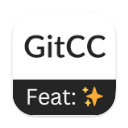
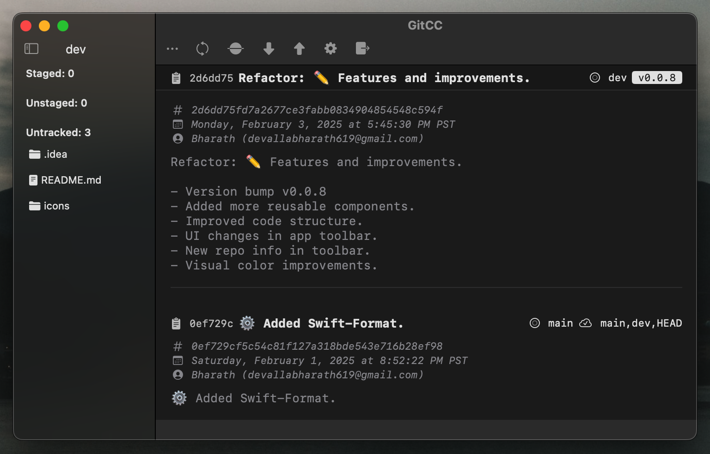

# GitConventionalCommit


GitConventionalCommit is a macOS application designed to simplify the creation of standardized commit messages following the [Conventional Commits](https://www.conventionalcommits.org/) specification. It provides a user-friendly interface for managing Git repositories and creating well-formatted commit messages with appropriate types, scopes, and emoji icons.

<p align="center">
  
</p>

## Features

- **Conventional Commit Format**: Create standardized commit messages with proper type, scope, and description
- **Emoji Support**: Add visual context to commits with relevant emoji icons
- **Git Integration**: Perform common Git operations directly from the app
  - Stage/unstage files
  - Discard changes
  - Commit changes
  - Pull/push changes
  - View commit history
- **File Management**: View and manage staged, unstaged, and untracked files
- **Recent Repositories**: Quick access to recently opened repositories
- **External Editor Support**: Can be used as an external editor for Git commit messages

## Commit Types

The application supports the following conventional commit types:

- **feat**: A new feature
- **fix**: A bug fix
- **docs**: Documentation changes
- **style**: Changes that do not affect the meaning of the code
- **chore**: Other changes that don't modify source or test files
- **refactor**: Code changes that neither fix a bug nor add a feature
- **revert**: Reverts a previous commit
- **perf**: Performance improvements
- **test**: Adding or correcting tests
- **build**: Changes to the build system or dependencies
- **ci**: Changes to CI configuration files and scripts

## Commit Scopes with Emoji

Each commit can include a scope with an associated emoji to provide visual context:

- 🎉 Init - Initial commit
- ✨ New - New features
- 💡 Idea - New ideas or concepts
- 📌 Pin - Pin dependencies
- ➕ Add - Add files or dependencies
- ➖ Remove - Remove files or dependencies
- 🗑 Delete - Delete files or code
- ✏️ Edit - Edit files or code
- 🚧 Working - Work in progress
- ✅ Done - Completed tasks
- 🐛 Bug - Bug fixes
- 📝 Doc - Documentation updates
- ♿️ Accessibility - Accessibility improvements
- 💄 Style - UI/style updates
- 🎨 Theme - Theme changes
- 🔧 Conf - Configuration changes
- ⚙️ Settings - Settings changes
- 📈 Performance - Performance improvements
- 📦 Package - Package updates
- 🚚 Delivery - Delivery changes
- 🚀 Deploy - Deployment changes
- ⏪ Revert - Revert changes

## Installation

1. Download the latest release from the [Releases](https://github.com/yourusername/GitConventionalCommit/releases) page
2. Move the application to your Applications folder
3. Launch the application

### As a Standalone Application

1. Open the application
2. Choose a Git repository from the file picker or recent repositories list
3. View and manage your repository files
4. Create commits with the conventional format using the commit form

### As an External Git Editor

You can configure Git to use GitConventionalCommit as your default commit message editor:

```bash
git config --global core.editor "open -W -a GitConventionalCommit"
```

## Requirements

- macOS 10.15 or later
- Git installed on your system

## License

[MIT License](LICENSE)

## Contributing

Contributions are welcome! Please feel free to submit a Pull Request.
